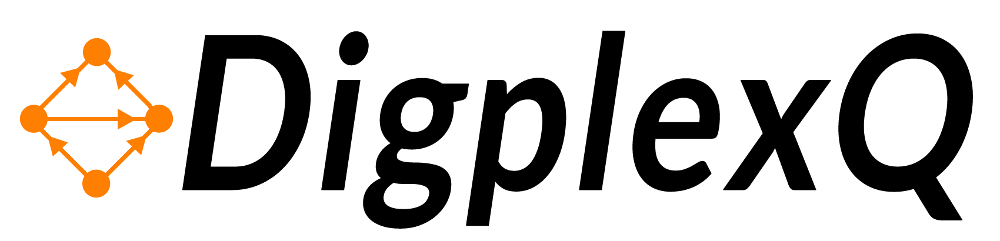

[]()
[](https://pypi.org/project/digplexq/)

------
DigplexQ is a Python package to perform computations with digraph-based complexes (e.g., directed flag complexes and path complexes)

* Free software: MIT license
* Documentation: [Documentation_DigplexQ]

Installation
--------

```bash
pip install digplexq
```

Examples
--------

```python
from digplexq.directed_q_analysis import *
from digplexq.digraph_based_complexes import *
from digplexq.structure_based_simplicial_measures import *
from digplexq.random_digraphs import *
from digplexq.utils import *

M = directed_erdos_renyi_GnM_model(20, 40, weight=False)
M = remove_double_edges(M) #remove double edges.

#Directed flag complex:
DFC_dim_none = DirectedFlagComplex(M, "by_dimension_without_nodes")

#Maximal directed simplices:
maxsimp = MaximalSimplices(DFC_dim_none)

#q-Adjacency matrix:
fast_q_adjacency_matrix(M, q=1)

#in-q-degree centrality
in_q_degree_centrality(M, q=1, results="nodes")
```

Dependencies
--------

* [NumPy](https://github.com/numpy/numpy)
* [SciPy](https://scipy.org/)
* [NetworkX](https://github.com/networkx/networkx)
* [gtda](https://giotto-ai.github.io/gtda-docs/0.5.1/library.html)
* [persim](https://persim.scikit-tda.org/en/latest/)
* [hodgelaplacians](https://github.com/tsitsvero/hodgelaplacians)


